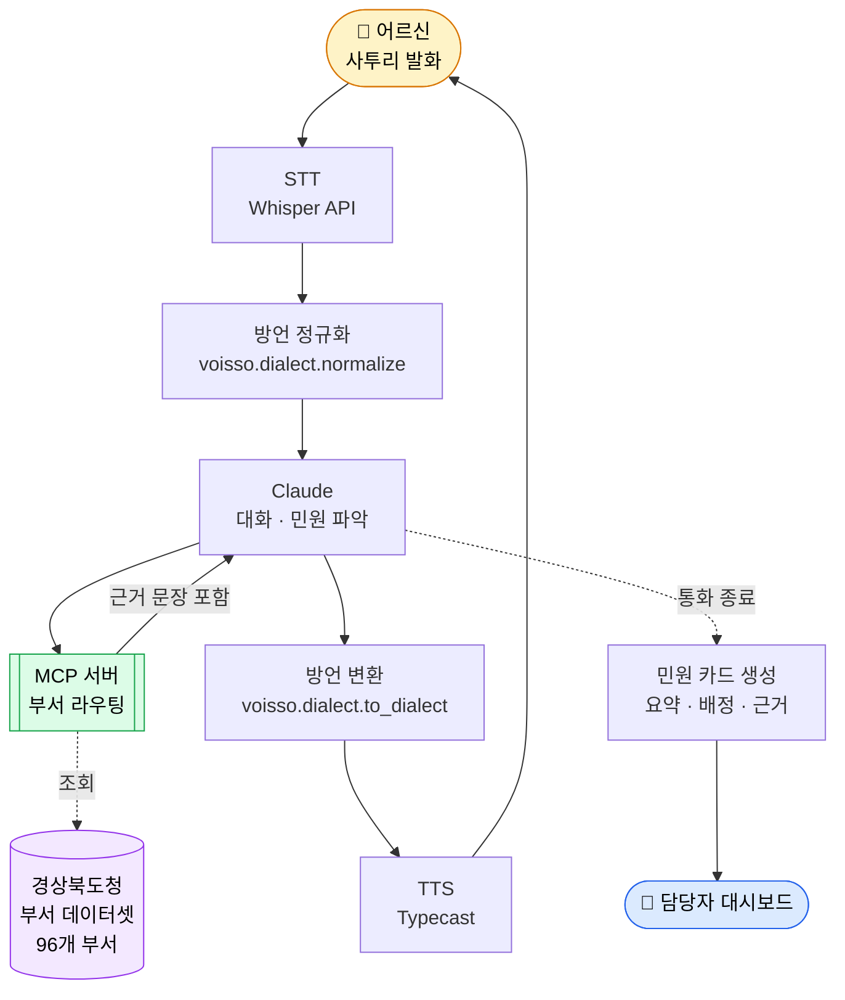

# Voisso (보이소)

> **경북 어르신이 사투리로 전화하면, AI가 알아듣고 담당 부서로 연결한다.**

<!-- ─────────────────────────────────────────────────────────────────────
     TODO(demo): 여기에 데모 GIF / 스크린샷을 넣는다.
     
     
     ───────────────────────────────────────────────────────────────────── -->

**English summary** — *Voisso* is an open-source voice complaint-routing system for
Gyeongsangbuk-do Province, Korea. Elderly residents speak in the local Gyeongbuk
dialect; Voisso normalizes the dialect, understands the complaint through
conversation, and routes it to the right provincial department — citing the exact
line of that department's official duty statement as evidence. It is built on real
public data scraped from the provincial government's organization chart
(96 departments, 1,866 staff duty entries) and exposes that data to any AI agent
through an MCP server. Runs on a laptop with no API keys and no model downloads.
MIT licensed.

---

## Voisso가 무엇인가

- **경북 어르신이 사투리로 말해도 알아듣는 민원 전화 AI**다. 버튼을 누를 필요도, 표준어를 쓸 필요도 없다.
- 대화로 민원을 파악해 **경상북도청 96개 부서 중 담당 부서로 라우팅**하고, 담당자에게 요약 카드를 보낸다.
- 이름은 **"들어보이소"의 '보이소'** 와 **voice** 를 합친 것이다. 경북 사람이 말을 걸 때 쓰는 그 말이다.

## 어떤 문제를 푸는가

경북은 전국에서 고령 인구 비율이 가장 높은 광역자치단체 중 하나다. 그런데 민원 창구는 그 반대 방향으로 가고 있다.

- **ARS는 어르신에게 벽이다.** "1번 도로, 2번 상하수도, 3번…" 을 끝까지 듣고 자기 민원이 몇 번인지 판단해야 한다. 잘못 누르면 처음부터다.
- **표준어만 알아듣는 음성 안내는 더 큰 벽이다.** "물이 안 빠져가 큰일이라예"를 못 알아듣는 시스템 앞에서 어르신은 말을 고쳐야 한다. 그건 민원인이 할 일이 아니다.
- **담당자도 곤란하다.** 잘못 배정된 민원은 부서를 떠돈다. "왜 나한테 왔는지" 알 수 없으니 다시 넘기는 것 말고 할 수 있는 게 없다.

Voisso는 세 번째 문제를 **근거(evidence)** 로 푼다. 라우팅 결과에는 항상 **그 부서의 사무분장 원문 문장**이 따라붙는다. 담당자는 "AI가 왜 나한테 보냈는지"를 한 줄로 확인한다.

---

## 빠른 시작

**키가 하나도 없어도 전 과정이 돌아간다.** 아래를 그대로 복사해 붙여넣으면 된다.

> **노트북에서 바로 실행된다.**
> Voisso는 무거운 모델 가중치를 내려받지 않는다. 음성 인식과 합성은 전부 클라우드 API로
> 처리하고, 핵심 파이프라인(사투리 정규화 → 부서 라우팅 → 민원 카드)은 **파이썬 표준
> 라이브러리만으로** 동작한다. 내려받는 것은 이 저장소(수 MB)뿐이고, GPU도 필요 없다.

### 준비물

- **Python 3.10 이상** (`python3 --version` 으로 확인)
- 그게 전부다. Node.js, Docker, GPU 모두 필요 없다.

### 1단계 — 내려받고 가상환경 만들기

```bash
# 저장소를 내려받는다
git clone https://github.com/<your-org>/voisso.git
cd voisso

# 파이썬 가상환경을 만든다 (시스템 파이썬을 건드리지 않기 위함)
python3 -m venv .venv

# 가상환경을 활성화한다
source .venv/bin/activate          # macOS / Linux
# .venv\Scripts\activate           # Windows PowerShell 이라면 이 줄을 대신 실행
```

### 2단계 — 환경변수 파일 만들기

```bash
# 예시 파일을 복사한다. 내용은 채우지 않아도 된다.
cp .env.example .env
```

`.env`를 **비운 채로 두면 텍스트 모드**로 동작한다. 음성 입출력만 꺼지고, 사투리 정규화·부서 라우팅·민원 카드 생성은 전부 그대로 확인할 수 있다. 키를 넣고 싶다면 `.env.example`의 주석에 각 키가 무엇이고 없으면 어떻게 되는지 적혀 있다.

### 3단계 — 바로 확인해 보기

부서 데이터셋은 저장소에 이미 들어 있다. 크롤링 없이 바로 라우팅이 된다.

```bash
# 민원 문장 하나를 넣고 담당 부서가 나오는지 본다
python3 -c "
from voisso.routing import route
r = route('비가 오면 집앞 도로에 물이 안 빠져가 큰일이라예')
print('확신:', r['confident'], '|', r['reason'])
for m in r['matches']:
    print(f\"  {m['full_name']} ({m['position']}) 점수 {m['score']}\")
    print(f\"    근거: {m['evidence']}\")
"
```

아래와 같은 형태로 나오면 정상이다. (점수는 라우팅 엔진 튜닝에 따라 달라진다.)

```
확신: True | 1순위 점수 0.59, 2순위와 격차 0.20 — 단독 배정 가능
  건설도시국 도로철도과 (주무관) 점수 0.59
    근거: 도로관리청이 아닌 자의 도로공사 시행 허가 및 관리 등
```

**여기서 중요한 건 마지막 줄이다.** `근거`는 AI가 지어낸 설명이 아니라 경상북도청이
공개한 그 부서의 **사무분장 원문**이다. 이 문장이 민원 카드를 거쳐 담당자 화면까지
그대로 전달된다.

### 4단계 — 담당자 대시보드 열어보기

```bash
# 빌드가 필요 없다. 브라우저로 파일을 열기만 하면 된다.
open web/dashboard/index.html          # macOS
# xdg-open web/dashboard/index.html    # Linux
# start web\dashboard\index.html       # Windows
```

통화 화면도 같은 방식으로 열 수 있다. 서버 없이 목 데이터로 흐름을 확인하는 모드다.

```bash
open web/call/index.html               # macOS
```

### 5단계 (선택) — 데이터를 최신으로 갱신하기

```bash
# 경상북도청 홈페이지에서 부서·사무분장을 다시 수집한다.
# 외부 패키지가 필요 없다 (표준 라이브러리 urllib 사용).
python3 scripts/scrape_gb_departments.py

# 캐시를 무시하고 처음부터 다시 받으려면
python3 scripts/scrape_gb_departments.py --refresh
```

---

## 현재 상태

정직하게 적는다. 해커톤 기간 중 병렬 개발 중이며, **아래 표에서 ✅ 표시된 것만 지금 동작한다.**

| 구성요소 | 상태 | 확인 방법 |
|---|---|---|
| 부서 데이터셋 (96개 부서 / 1,866건) | ✅ 동작 | `data/gb_departments.json` |
| 크롤러 (데이터 갱신) | ✅ 동작 | `python3 scripts/scrape_gb_departments.py --help` |
| 부서 라우팅 엔진 (근거 포함) | ✅ 동작 | 위 3단계 |
| 담당자 대시보드 (목 데이터) | ✅ 동작 | 위 4단계 |
| 통화 UI (목 데이터) | ✅ 동작 | `open web/call/index.html` |
| 사투리 정규화 / 변환 | 🚧 작업 중 | `voisso/dialect/` |
| HTTP API 서버 | 🚧 작업 중 | `server/` |
| MCP 서버 | 🚧 작업 중 | `mcp_server/` |

🚧 항목의 실행 방법은 아래에 계약서(`docs/CONTRACT.md`) 기준으로 적어 두었다. **완성되기 전까지 그 명령은 동작하지 않는다.**

---

## MCP 서버로 붙이기 🚧 *(작업 중)*

Voisso는 경상북도청 부서 데이터를 **어떤 AI 에이전트든 쓸 수 있는 MCP 서버**로 노출한다. Claude Desktop에 붙이려면 설정 파일에 아래를 추가한다.

**설정 파일 위치**

| OS | 경로 |
|---|---|
| macOS | `~/Library/Application Support/Claude/claude_desktop_config.json` |
| Windows | `%APPDATA%\Claude\claude_desktop_config.json` |
| Linux | `~/.config/Claude/claude_desktop_config.json` |

**설정 내용** (`/absolute/path/to/voisso` 를 실제 경로로 바꾼다)

```json
{
  "mcpServers": {
    "voisso": {
      "command": "/absolute/path/to/voisso/.venv/bin/python",
      "args": ["-m", "mcp_server"],
      "env": {
        "VOISSO_DATA_DIR": "/absolute/path/to/voisso/data"
      }
    }
  }
}
```

저장한 뒤 Claude Desktop을 완전히 종료했다가 다시 실행한다. 그러면 이렇게 물어볼 수 있다.

> "집 앞 도로에 물이 안 빠지는데 경북도청 어느 부서에 연락해야 해?"

제공되는 도구는 계약서 4절 인터페이스를 따른다 — `find_department`, `get_department`, `list_departments`.

---

## 데이터셋

### 출처

| 항목 | 값 |
|---|---|
| 출처 | **경상북도청 본청 조직도 / 부서별 직원안내** |
| 원본 URL | https://www.gb.go.kr/Main/programs/organizationChart/organizationPartInfo.do |
| 수집 규모 | 부서 96개 / 담당업무 1,866건 |
| 라이선스 | **공공누리 제3유형** (출처표시 + 변경금지) — 상세는 [`docs/DATA_LICENSE.md`](docs/DATA_LICENSE.md) |

> **출처: 경상북도청 (https://www.gb.go.kr)**
> 본 데이터는 경상북도청이 공개한 자료를 수집·재구성한 것이다.

### 갱신 방법

조직 개편이 있으면 스크레이퍼를 다시 실행하면 된다. 별도 설정이 필요 없다.

```bash
python3 scripts/scrape_gb_departments.py --refresh
```

`data/gb_departments.json`이 새로 쓰이고 `meta.fetched_at`이 갱신된다. 원본 HTML은 `data/raw/`에 캐시되지만 저장소에는 포함하지 않는다(용량이 크고 언제든 재생성 가능하다).

### 스키마 요약

```jsonc
{
  "meta": {
    "source_url": "...",              // 원본 페이지
    "org": "경상북도청 본청",
    "fetched_at": "2026-08-21T13:37:52Z",
    "department_count": 96,
    "staff_count": 1866,
    "phone_masked": true              // 전화번호가 토큰으로 치환됐음을 뜻한다
  },
  "departments": [{
    "id": "gb-6470783-6470793",       // 안정적인 부서 식별자
    "name": "정책기획관",
    "parent": "기획조정실",
    "full_name": "기획조정실 정책기획관",
    "source_url": "...",              // 이 부서의 원본 페이지
    "duties": ["도정의 기획・조정", "..."],   // 부서 단위 사무분장 (원문 보존)
    "staff": [{
      "position": "주무관",            // 직위. 실명은 원본에 없다.
      "duty": "도정 주요업무계획 수립, ...",  // 담당업무 원문 → 라우팅 근거가 된다
      "phone_token": "PHONE_0042"     // 실제 번호가 아니라 토큰
    }]
  }]
}
```

전체 스키마는 [`docs/CONTRACT.md`](docs/CONTRACT.md) 3절에 고정되어 있다.

### 🔒 전화번호 마스킹 정책과 그 이유

**공개 데이터셋에는 실제 전화번호가 하나도 들어 있지 않다.** 전부 `PHONE_0042` 형태의 토큰으로 치환되어 있다.

**왜 이렇게 하는가**

1. **원본이 공개되어 있다고 해서 재배포해도 되는 건 아니다.** 공무원 개인 업무 전화번호를 기계가 읽기 좋은 형태로 한데 모아 GitHub에 올리면, 원래 목적(민원인이 담당자에게 연락)과 무관한 대량 수집·스팸·보이스피싱에 그대로 쓰인다. 개별 페이지에 흩어져 있는 것과 정규화된 데이터셋으로 묶이는 것은 위험도가 다르다.
2. **기능적으로 필요 없다.** 라우팅에 필요한 것은 "어느 부서 누가 무슨 일을 하는가"이지 번호 자체가 아니다. 번호는 실제로 연결할 순간에만 있으면 된다.
3. **가짜 번호를 만들지 않는다.** 무작위 번호는 실존하는 타인의 번호와 충돌한다. 그래서 삭제나 난수화가 아니라 **토큰**을 쓴다.

**실제 번호는 어떻게 되는가**

토큰↔번호 매핑은 `data/private/phone_map.json`에만 두고, 이 경로는 `.gitignore`로 차단되어 저장소에 올라가지 않는다. 런타임은 `resolve_phone(token)`으로 조회한다.

```python
from voisso.data import resolve_phone
resolve_phone("PHONE_0042")   # 매핑이 있으면 실제 번호
                              # 없으면 경북도청 대표번호 "1522-0120" 으로 폴백
```

**매핑 파일이 없어도 시스템은 정상 동작한다.** 모든 안내가 대표번호로 나갈 뿐이다. 그래서 처음 내려받은 사람도 아무 준비 없이 실행할 수 있다.

---

## 아키텍처



핵심은 **`E → D` 로 돌아가는 화살표**다. 라우팅 결과에는 언제나 그 판단의 근거가 된 사무분장 원문이 실려 있고, 그 근거가 민원 카드를 거쳐 담당자 화면까지 그대로 전달된다. 어디서도 "AI가 그렇게 판단했다"로 끝나지 않는다.

---

## 다른 지자체에 이식하기

Voisso는 경북 전용으로 만들어졌지만, **부서 데이터의 형태만 맞으면 어느 지자체든 동작한다.**

1. **스크레이퍼의 대상 URL을 교체한다.** `scripts/scrape_gb_departments.py` 상단의 기관 URL과 파싱 규칙을 해당 지자체 조직도 페이지에 맞게 고친다. 대부분의 지자체 홈페이지가 비슷한 표 구조(소속부서/직책/전화번호/담당업무)를 쓴다.
2. **스키마를 맞춘다.** 출력이 `docs/CONTRACT.md` 3절 스키마를 따르기만 하면 라우팅·MCP·대시보드는 **코드 수정 없이 그대로 작동한다.**
3. **방언 사전을 교체한다.** `voisso/dialect/`의 어휘·규칙을 해당 지역 방언으로 바꾼다. 이 부분이 지역화의 핵심이다.
4. **대표번호 폴백을 바꾼다.** 경북도청 `1522-0120` 대신 해당 기관 대표번호로 설정한다.
5. **라이선스를 재확인한다.** 지자체마다 공공누리 유형이 다르다. 반드시 해당 기관 저작권정책 페이지를 확인할 것. ([`docs/DATA_LICENSE.md`](docs/DATA_LICENSE.md)에 확인 절차를 정리해 두었다.)

---

## 한계 (알고 쓰라)

숨기지 않고 적는다. 지금 시점의 Voisso는 다음과 같다.

| 한계 | 현재 | 앞으로 |
|---|---|---|
| **실제 전화망(PSTN) 미연동** | 진짜 전화를 걸 수 없다. **브라우저 마이크를 쓰는 웹 데모**다. | Twilio·국내 VoIP 사업자 연동. 통화 오디오를 같은 파이프라인에 흘려보내면 되므로 구조 변경은 필요 없다. |
| **사투리 인식은 STT에 의존** | Whisper API가 경북 사투리를 완벽히 받아쓰지 못한다. 정규화 단계에서 보정하지만 한계가 있다. | 경북 방언 데이터로 STT 후처리 모델 학습. 단, AI Hub 데이터는 재배포가 불가하므로 저장소에는 스크립트만 제공한다. |
| **사투리 TTS 품질** | 경북 억양을 내는 오픈 TTS 모델이 사실상 없다. 상용 서비스의 사투리 보이스에 의존한다. | 경북 시군별 지역어 보이스 확보. 안동권·동해안권은 흔히 아는 사투리와 다르다. |
| **라우팅은 사무분장 텍스트 기반** | 원문에 안 적힌 업무는 못 찾는다. 그래서 확신이 낮으면 **단정하지 않고 후보를 여러 개 제시**한다. | 실제 민원 이력으로 보정. |
| **개인정보** | 실제 번호 매핑은 저장소 밖에만 둔다. | 운영 시 기관 내부 시스템과 연동. |

---

## 기여하기

1. **먼저 [`docs/CONTRACT.md`](docs/CONTRACT.md)를 읽어라.** 모듈 간 스키마와 함수 시그니처가 고정되어 있다. 임의로 바꾸면 다른 모듈이 깨진다.
2. **개인정보를 커밋하지 마라.** 실제 전화번호, API 키, 통화 기록은 `.gitignore`로 막혀 있다. 우회하지 마라.
3. **데이터를 추가할 때는 라이선스를 확인하라.** [`docs/DATA_LICENSE.md`](docs/DATA_LICENSE.md)에 확인 방법이 있다. **AI Hub 데이터에서 파생된 파일은 저장소에 넣을 수 없다.**
4. **의존성을 최소로 유지하라.** 표준 라이브러리로 되는 일은 표준 라이브러리로 한다. 무거운 모델을 내려받는 코드는 받지 않는다.
5. **README를 같이 고쳐라.** 새 명령·환경변수·의존성이 생기면 같은 PR에서 README를 갱신한다. *"README만 보고 처음 보는 사람이 실행할 수 있어야 한다"* 가 이 프로젝트의 기준이다.

---

## 라이선스

**소스 코드는 [MIT 라이선스](LICENSE)를 따른다.**

**데이터는 별도 조건이 적용된다.** MIT는 코드에만 적용되며, 데이터에는 각 출처의 라이선스가 그대로 남는다. 이 구분을 반드시 확인할 것.

| 대상 | 라이선스 |
|---|---|
| Voisso 소스 코드 | MIT |
| 경상북도청 부서 데이터 | 공공누리 제3유형 (출처표시 + 변경금지) |
| AI Hub 방언 데이터 | AI-Hub 이용정책 — **저장소에 포함하지 않는다.** 이용자가 직접 신청해 받아야 한다. |

자세한 근거와 판단 과정은 [`docs/DATA_LICENSE.md`](docs/DATA_LICENSE.md)에 정리되어 있다.

### 데이터 출처 표기

> **출처: 경상북도청** (https://www.gb.go.kr)
> 부서별 직원안내 / 조직도, 2026-08-21 수집.
> 본 저작물은 경상북도청에서 공공누리 제3유형으로 개방한 자료를 이용하였습니다.

---

<sub>JunctionX Korea 2026 · 경상북도 공공데이터 챌린지 출품작</sub>
