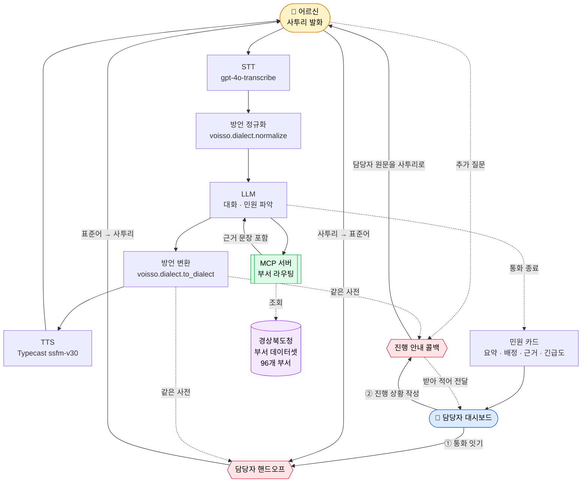

# Voisso (보이소)

[](https://github.com/<your-org>/voisso/actions/workflows/ci.yml)
[](LICENSE)
[](https://www.python.org/downloads/)

> **경북 어르신이 사투리로 전화하면, AI가 알아듣고 담당 부서로 연결한다.**

<!-- ═════════════════════════════════════════════════════════════════════
     데모 이미지 자리 — 촬영 후 아래 주석을 풀어 그대로 쓴다.
     촬영 대본과 파일명 규약: docs/DEMO_SCRIPT.md  ("촬영 후 할 일" 절)
     디렉터리 docs/images/ 는 촬영 후 만든다.

     ① 히어로 (통화 → STT 오인식 → 정규화 교정 → 슬롯 채움 / 대본 1~2단계)
     

     ② 히어로 하단 (담당자 대시보드 목록 + 상세 / 대본 4단계)
     

     ※ ③ 배정 근거 인용 블록  -> docs/images/demo-evidence.png  는 "데이터셋" 절에,
        ④ MCP 툴 호출 화면    -> docs/images/demo-mcp.png       은 "MCP 서버로 붙이기" 절에
        각각 자리를 잡아 두었다. 파일명을 바꾸면 세 군데를 모두 고쳐라.
     ═════════════════════════════════════════════════════════════════════ -->

**English summary** — *Voisso* is an open-source voice complaint-routing system for
Gyeongsangbuk-do Province, Korea. Elderly residents speak in the local Gyeongbuk
dialect; Voisso normalizes the dialect, understands the complaint through
conversation, and routes it to the right provincial department — citing the exact
line of that department's official duty statement as evidence. It is built on real
public data scraped from the provincial government's organization chart
(96 departments, 1,866 staff duty entries) and exposes that data to any AI agent
through an MCP server. Runs on a laptop with no API keys and no model downloads.
MIT licensed.

---

## Voisso가 무엇인가

- **경북 어르신이 사투리로 말해도 알아듣는 민원 전화 AI**다. 버튼을 누를 필요도, 표준어를 쓸 필요도 없다.
- 대화로 민원을 파악해 **경상북도청 96개 부서 중 담당 부서로 라우팅**하고, 담당자에게 요약 카드를 보낸다.
- 이름은 **"들어보이소"의 '보이소'** 와 **voice** 를 합친 것이다. 경북 사람이 말을 걸 때 쓰는 그 말이다.

## 어떤 문제를 푸는가

경북은 전국에서 고령 인구 비율이 가장 높은 광역자치단체 중 하나다. 그런데 민원 창구는 그 반대 방향으로 가고 있다.

- **ARS는 어르신에게 벽이다.** "1번 도로, 2번 상하수도, 3번…" 을 끝까지 듣고 자기 민원이 몇 번인지 판단해야 한다. 잘못 누르면 처음부터다.
- **표준어만 알아듣는 음성 안내는 더 큰 벽이다.** "물이 안 빠져가 큰일이라예"를 못 알아듣는 시스템 앞에서 어르신은 말을 고쳐야 한다. 그건 민원인이 할 일이 아니다.
- **담당자도 곤란하다.** 잘못 배정된 민원은 부서를 떠돈다. "왜 나한테 왔는지" 알 수 없으니 다시 넘기는 것 말고 할 수 있는 게 없다.

Voisso는 세 번째 문제를 **근거(evidence)** 로 푼다. 라우팅 결과에는 항상 **그 부서의 사무분장 원문 문장**이 따라붙는다. 담당자는 "AI가 왜 나한테 보냈는지"를 한 줄로 확인한다.

---

## 빠른 시작

**키가 하나도 없어도 전 과정이 돌아간다.** 아래를 그대로 복사해 붙여넣으면 된다.

> **노트북에서 바로 실행된다.**
> Voisso는 무거운 모델 가중치를 내려받지 않는다. 음성 인식과 합성은 전부 클라우드 API로
> 처리하고, 핵심 파이프라인(사투리 정규화 → 부서 라우팅 → 민원 카드)은 **파이썬 표준
> 라이브러리만으로** 동작한다.
>
> 내려받는 것은 **저장소 약 1.4MB**와 3단계에서 수집하는 **부서 데이터 약 0.4MB**가
> 전부다. GPU도, 모델 체크포인트도, `pip install` 도 필요 없다.

### 준비물

- **Python 3.10 이상** (`python3 --version` 으로 확인)
- 그게 전부다. Node.js, Docker, GPU 모두 필요 없다.

### 가장 빠른 길 — 스크립트 두 개

단계를 하나씩 밟기 전에, 전부 자동으로 해 주는 스크립트가 있다.

```bash
git clone https://github.com/<your-org>/voisso.git && cd voisso

./scripts/demo.sh     # 데이터 준비 → 서버 기동 → 브라우저 열기까지 한 번에
./scripts/test.sh     # 지금 무엇이 동작하는지 한눈에 확인
```

- **`./scripts/demo.sh`** — 7단계를 순서대로 밟으며 무엇을 하는지 화면에 출력한다.
  실패하면 *다음에 무엇을 하면 되는지* 알려주고 멈춘다. 발표장 네트워크가 끊겨도
  `data/gb_departments.json` 이 이미 있으면 그대로 돈다. `--no-browser` 로 브라우저를 막을 수 있다.
- **`./scripts/test.sh`** — 흩어진 테스트를 한 번에 돌린다. **키가 없어서 못 도는 검사는
  실패가 아니라 `SKIP` 으로 표시**되므로, 키 없이 처음 받은 사람도 초록불을 볼 수 있다.
  `--ci` 는 네트워크·실데이터·키 의존을 전부 빼고, `--network` 는 실제 크롤링까지 포함한다.

무슨 일이 일어나는지 직접 보고 싶다면 아래 단계를 따라가면 된다. 결과는 같다.

### 1단계 — 내려받고 가상환경 만들기

```bash
# 저장소를 내려받는다
git clone https://github.com/<your-org>/voisso.git
cd voisso

# 파이썬 가상환경을 만든다 (시스템 파이썬을 건드리지 않기 위함)
python3 -m venv .venv

# 가상환경을 활성화한다
source .venv/bin/activate          # macOS / Linux
# .venv\Scripts\activate           # Windows PowerShell 이라면 이 줄을 대신 실행
```

### 2단계 — 환경변수 파일 만들기

```bash
# 예시 파일을 복사한다. 내용은 채우지 않아도 된다.
cp .env.example .env
```

`.env`를 **비운 채로 두면 텍스트 모드**로 동작한다. 음성 입출력만 꺼지고, 사투리 정규화·부서 라우팅·민원 카드 생성은 전부 그대로 확인할 수 있다. 키를 넣고 싶다면 `.env.example`의 주석에 각 키가 무엇이고 없으면 어떻게 되는지 적혀 있다.

### 3단계 — 부서 데이터 만들기

**이 저장소에는 부서 데이터가 들어 있지 않다.** 아래 명령으로 경상북도청 홈페이지에서
직접 생성한다. (이유는 [아래](#왜-데이터를-동봉하지-않는가)에 적어 두었다.)

```bash
# 경상북도청 조직도에서 96개 부서와 사무분장을 수집한다.
python3 scripts/scrape_gb_departments.py
```

- **외부 패키지가 필요 없다.** 파이썬 표준 라이브러리(`urllib`)만 쓴다.
- **약 35초면 끝난다.** (데이터가 없는 신규 클론에서 2회 실측) 진행 상황이 화면에 표시된다.
- **네트워크 연결이 필요하다.** gb.go.kr 에 접속해 페이지를 받아오기 때문이다.
- 결과물은 `data/gb_departments.json` 으로 저장되고, 원본 HTML은 `data/raw/` 에
  캐시된다. 다시 실행하면 캐시를 재사용하므로 훨씬 빠르다.

### 4단계 — 라우팅이 되는지 확인하기

```bash
# 민원 문장 하나를 넣고 담당 부서가 나오는지 본다
python3 -c "
from voisso.routing import route
r = route('비가 오면 집앞 도로에 물이 안 빠져가 큰일이라예')
print('확신:', r['confident'], '|', r['reason'])
for m in r['matches']:
    print(f\"  {m['full_name']} ({m['position']}) 점수 {m['score']}\")
    print(f\"    근거: {m['evidence']}\")
"
```

아래와 같이 나오면 정상이다. **이 출력은 실제 실행 결과를 그대로 옮긴 것이다.**

```
확신: True | 1순위 점수 0.71, 2순위와 격차 0.32 — 단독 배정 가능
  기후환경국 맑은물정책과 (주무관) 점수 0.711
    근거: ◦ 하수도분야 국도비 보조사업 예산 및 추진 ◦ 하수도사업 재원협의 및 총사업비변경
          관련 업무 ◦ 하수도 재난재해대책(호우, 태풍 등) 수립 및 시행 …
  기후환경국 수자원관리과 (주무관) 점수 0.3903
  건설도시국 도로철도과 (주무관) 점수 0.3208
```

**여기서 중요한 건 `근거` 한 줄이다.** AI가 지어낸 설명이 아니라 경상북도청이 공개한 그 부서의
**사무분장 원문**이고, 이 문장이 민원 카드를 거쳐 담당자 화면까지 그대로 전달된다.

### 4-1단계 — 확신이 없으면 단정하지 않는다

Voisso는 점수가 높으면 단독 배정하고, **갈릴 수 있는 민원은 후보를 내민다.** 아래 두 질의를
연달아 돌려 보면 그 차이가 한 화면에 드러난다.

```bash
python3 -c "
from voisso.routing import route
for q in ['상수도관이 터져가 물이 콸콸 샙니더', '집이 물에 잠겼어요']:
    r = route(q)
    print(q)
    print('  확신:', r['confident'], '|', r['reason'])
    for m in r['matches'][:2]:
        print(f\"    {m['full_name']} {m['score']}\")
"
```

```
상수도관이 터져가 물이 콸콸 샙니더
  확신: True | 1순위 점수 0.92, 2순위와 격차 0.41 — 단독 배정 가능
    기후환경국 맑은물정책과 0.9191
    안전행정실 회계관리과 0.5072

집이 물에 잠겼어요
  확신: False | '침수 / 물에 잠김 (원인 미확인)' 은(는) 맥락에 따라 소관이 갈립니다
                — 후보 3곳을 함께 제시하고 담당자가 판단하게 하세요
    안전행정실 자연재난과 0.7624
    기후환경국 맑은물정책과 0.5942
```

**`확신: False` 는 고장이 아니라 설계다.** 집이 물에 잠긴 것은 자연재난 피해일 수도, 하수도
문제일 수도 있다. 원인을 모르는 채로 한 곳을 고르면 민원인은 헛걸음을 하고 담당자는 남의
민원을 되돌려 보내야 한다. 그래서 Voisso는 **단정 대신 근거가 붙은 후보를 순위로 내밀고,
판단은 사람이 한다.** 침수된 도로를 확신에 차서 관광과로 보내는 시스템보다 이쪽이 낫다.

### 4-2단계 — 소관이 아닌 것도 안다

```bash
python3 -c "
from voisso.routing import route
for q in ['경로당 지원 사업은 누가 담당하노?', '가로등이 깜빡깜빡한다']:
    r = route(q)
    print(q, '->', r['matches'][0]['full_name'] if r['matches'] else r['reason'])
"
```

```
경로당 지원 사업은 누가 담당하노? -> 복지건강국 어르신복지과      (점수 0.8938, 단독 배정)
가로등이 깜빡깜빡한다 -> '가로등 / 보안등' 은(는) 경상북도청이 아니라 시·군 소관 업무입니다.
                        도청 부서를 배정하지 않습니다.
```

**가로등이 매칭 0건인 것도 의도된 동작이다.** 가로등·보안등 유지관리, 생활폐기물 수거,
주민등록 사무는 **시·군 소관**이라 경상북도청 사무분장에 애초에 존재하지 않는다.
이런 질의에 억지로 비슷한 도청 부서를 붙이면 민원인은 헛걸음을 하고, 담당자는 소관이
아닌 민원을 되돌려 보내야 한다. Voisso는 `voisso/routing/concepts.py` 의 개념 사전에
**관할(도 / 시군 / 공동)** 을 표시해 두고, 시군 소관이면 부서를 배정하는 대신 시·군
민원실로 안내한다. **모른다고 말하는 것과 아는 것을 아는 것은 같은 기능이다.**

### 5단계 — 화면 열어보기

```bash
# 빌드가 필요 없다. 브라우저로 파일을 열기만 하면 된다.
open web/dashboard/index.html          # macOS
# xdg-open web/dashboard/index.html    # Linux
# start web\dashboard\index.html       # Windows
```

통화 화면도 같은 방식으로 열 수 있다. 서버 없이 목 데이터로 흐름을 확인하는 모드다.

```bash
open web/call/index.html               # macOS
```

### 6단계 (선택) — 전체 서비스 띄우기

여기까지는 `pip install` 없이 돌았다. 통화 UI와 대시보드를 **실서버에 붙여** 보려면
의존성 세 개(FastAPI · Uvicorn · `anthropic`)가 필요하다. 앞의 둘은 서버 자체에 필요하고,
`anthropic` 은 **대화 엔진을 Anthropic 으로 돌릴 때만** 쓰인다 — OpenAI 경로와 STT·TTS 는
전용 SDK 없이 표준 라이브러리(`urllib`)로 REST 호출만 한다.

```bash
# 서버 의존성을 설치한다 (여기서 처음으로 pip 를 쓴다)
pip install -r requirements.txt

# API 서버를 띄운다. 통화 UI와 대시보드도 함께 서빙한다.
python3 -m server
```

- 통화 화면 → http://localhost:8000/call/
- 담당자 대시보드 → http://localhost:8000/dashboard/
- 키가 하나도 없어도 뜬다. 음성 대신 텍스트로 대화하고, 나머지는 동일하게 동작한다.
- 지금 무엇이 켜져 있고 무엇이 폴백으로 도는지는 헬스체크가 그대로 알려준다.
  ```bash
  curl -s localhost:8000/api/health | python3 -m json.tool
  ```
- API 명세는 [`docs/CONTRACT.md`](docs/CONTRACT.md) 5절에 있다. 계약 5개 엔드포인트 외에
  첫 음성을 앞당기는 스트리밍 경로(`/api/call/turn/stream`, `/api/tts/stream`)가 추가로 열려 있고,
  **쓰지 않아도 계약은 그대로 지켜진다.**

### 7단계 (선택) — 데이터를 최신으로 갱신하기

조직 개편이 있었다면 캐시를 무시하고 다시 받는다.

```bash
python3 scripts/scrape_gb_departments.py --refresh
```

---

## 현재 상태

정직하게 적는다. 해커톤 기간 중 병렬 개발 중이며, **아래 표에서 ✅ 표시된 것만 지금 동작한다.**

| 구성요소 | 상태 | 확인 방법 |
|---|---|---|
| 크롤러 (부서 데이터 생성) | ✅ 동작 | 위 3단계 |
| 부서 데이터셋 (96개 부서 / 1,866건) | ✅ 생성됨 | **3단계 실행 후** `data/gb_departments.json` 에 만들어진다 |
| 부서 라우팅 엔진 (근거 포함) | ✅ 동작 | 위 4단계 |
| 사투리 정규화 / 변환 (어휘 382개 · 어미 규칙 70개) | ✅ 동작 | 위 4단계 · `python3 -c "from voisso.dialect import lexicon_size; print(lexicon_size())"` |
| 담당자 대시보드 (목 데이터) | ✅ 동작 | 위 5단계 |
| 통화 UI (목 데이터) | ✅ 동작 | 위 5단계 |
| MCP 서버 (툴 6종) | ✅ 동작 | `python3 -m mcp_server.selftest` — 셀프테스트로 계약 준수를 검증한다 |
| 대화 엔진 (슬롯 채우기 · 요약) | ✅ 동작 | `python3 -m server.selftest` — 키 없이 전 흐름 통과 |
| HTTP API 서버 | ✅ 동작 | `pip install -r requirements.txt` 후 `python3 -m server` |
| 통합 테스트 · CI | ✅ 동작 | `./scripts/test.sh` · `.github/workflows/ci.yml` |
| 통합 리허설 (H1 자동 검증) | ✅ 동작 | `python3 scripts/rehearsal.py --runs 3` → [`docs/REHEARSAL.md`](docs/REHEARSAL.md) 에 기록이 쌓인다 |
| 서버 E2E 측정 (구간별 지연) | ✅ 동작 | `python3 -m server.e2e_check` → [`docs/E2E_SERVER.md`](docs/E2E_SERVER.md) |
| 담당자 핸드오프 — 서버 API | ✅ 동작 | 4개 엔드포인트가 붙었고 양방향 통역까지 확인했다 ([아래 절](#담당자-핸드오프--양방향-통역)) |
| 담당자 핸드오프 — 화면 (통화·대시보드) | 🚧 **작업 중** | P7/P8 구현 중. **화면에서는 아직 쓸 수 없다** |
| 긴급도 판정 (`urgency`) | ✅ 동작 | 응급/중요/보통/낮음 + 판정 근거. 응급이면 **119 안내가 먼저 나간다** ([아래 절](#긴급도-판정--급한-민원을-앞으로)) |
| 진행 안내 콜백 — 서버 API | ✅ 동작 | 5개 엔드포인트. 브리핑 사투리 변환 + 질문 수집 확인 ([아래 절](#진행-안내-콜백--시스템이-먼저-전화를-건다)) |
| 진행 안내 콜백 — 수신 화면 | 🚧 **작업 중** | P7 수신 전화 UI · P8 작성란 구현 중 |
| 어르신 모드 / 시연 모드 분리 | ✅ 동작 | `web/call/index.html` 기본은 어르신 모드, `?debug=1` 로 시연 모드 |

3단계(데이터 수집)까지의 항목은 **데이터가 없는 신규 클론에서 실제로 실행해 확인했다.**
아래 두 줄은 각각 서버 의존성(6단계)과 수집된 부서 데이터(3단계)를 전제로 한다.

### 스스로 검증하는 방법

**키 없이도 대부분 돌아간다.** 앞의 세 줄은 키가 하나도 없어도 그대로 통과한다.

```bash
./scripts/test.sh                        # 전체 스위트 (없는 키는 SKIP)
python3 -m server.selftest               # 키 0개로 통화 전 과정
python3 -m mcp_server.selftest           # MCP 툴 계약 준수

# 아래 둘은 3단계(부서 데이터)와 6단계(pip install)를 먼저 끝냈을 때
python3 scripts/rehearsal.py --runs 3    # 서버 기동~민원카드~대시보드 반영까지 3회 반복
curl -s localhost:8000/api/health | python3 -m json.tool   # 지금 어떤 조합으로 도는가
```

`rehearsal.py` 는 **브라우저를 쓰지 않고 HTTP 로만** 데모를 재현하고, 결과를
`docs/REHEARSAL.md` 에 덧붙인다(손으로 고치지 않는다). 현재 8단계를 검증한다 —
사전조건 · 서버기동 · 통화완주 · 민원카드 · 대시보드 반영 · **담당자 핸드오프** ·
MCP 셀프테스트 · 정리. (진행 안내 콜백은 아직 리허설에 포함되지 않았다.)

| 옵션 | 하는 일 |
|---|---|
| `--runs N` | N회 반복. H1 기준은 3회 연속 통과다. |
| `--audio` | TTS·STT 를 켜고 **합성한 어르신 음성을 실제로 보내** 돈다. 응답 오디오와 스트리밍 첫 음성까지 잰다. **외부 API 비용이 발생한다** (합성 결과는 캐시해 재사용한다). |
| `--chaos` | 키 없음 · 잘못된 키(401) · 부서 데이터 없음 · 연결 거부 · 무응답 네트워크를 **실제로 주입하고** 통화가 끝까지 가는지 본다. 판정 기준은 완주 + 민원카드 + `evidence` 비지 않음이다. |

측정·검증 기록은 문서로 남아 있다.

| 문서 | 무엇이 적혀 있나 |
|---|---|
| [`docs/REHEARSAL.md`](docs/REHEARSAL.md) | 통합 리허설 실행 기록 (자동 생성) |
| [`docs/E2E_SERVER.md`](docs/E2E_SERVER.md) | 구간별 지연(STT/LLM/TTS), 동시 세션, 키 없는 모드 (자동 생성) |
| [`docs/FALLBACK_REPORT.md`](docs/FALLBACK_REPORT.md) | 키 없음·401·429·네트워크 단절·데이터 없음에서 실제로 어떻게 되는가 |
| [`docs/ACCESSIBILITY.md`](docs/ACCESSIBILITY.md) | 명도 대비·조작 요소 크기·키보드·스크린리더 측정 |
| [`docs/PORTABILITY.md`](docs/PORTABILITY.md) | 안동시 이식 실측과 거기서 터진 문제들 |

---

## 어르신 모드 / 시연 모드 — 접근성을 주장이 아니라 설계로

같은 화면이 두 개의 얼굴을 가진다. **기본값은 어르신 모드다.**

| | 어르신 모드 (기본) | 시연 모드 (`?debug=1`) |
|---|---|---|
| 보이는 것 | **큰 버튼 하나와 지금 할 말** | 전부 |
| 본문 글자 | 최소 **20px** (말풍선 **25px**) | 15px |
| 통화 버튼 | 화면 폭 92%, 높이 **200px** | 일반 크기 |
| 말하기 버튼 | 한 줄 전체, 높이 **96px**, 글자 병기 | 아이콘 버튼 |
| 슬롯 패널 · 타이머 · 표준어 대조 · 테마/글자크기 토글 | **숨김** | 표시 |
| 하단 진단 막대 | 없음 | `서버 · 입력경로 · 슬롯 3/4 · 응답 1.4초 · 담당자 연결됨` |
| 상태 표시 | 색이나 아이콘이 아니라 **글자로** ("듣고 있습니더") | 동일 + 진단 정보 |

```bash
http://localhost:8000/call/            # 어르신 모드 — 어르신에게 보여줄 화면
http://localhost:8000/call/?debug=1    # 시연 모드 — 심사·발표에서 내부 동작을 보여줄 화면
```

우상단 「시연」 버튼으로도 오간다. 선택은 `localStorage` 에 남는다.

**왜 이렇게 나눴나.** 접근성을 지키면 데모가 심심해지고, 데모를 화려하게 만들면 어르신이 못 쓴다.
둘 다 필요하다고 판단해서 **하나의 화면에 두 모드**를 뒀다. 중요한 것은 **기능을 지운 게 아니라
숨긴 것**이라는 점이다 — 어르신 모드에서 빠진 정보는 전부 시연 모드에 그대로 있다.

이건 "고령자 친화 UI를 만들었다"는 주장이 아니라 **설계로 증명하는 방식**이다. 측정 결과는
[`docs/ACCESSIBILITY.md`](docs/ACCESSIBILITY.md) 에 있다 — 명도 대비 최저 7.16:1(AAA 기준 7:1),
조작 요소 44×44px 이상, 키보드 도달과 스크린리더 안내까지 실제 브라우저에서 계산해 확인했다.

---

## 담당자 핸드오프 — 양방향 통역

> **서버 API는 동작한다. 화면(통화·대시보드)은 아직 작업 중이다.**
> 아래 `curl` 예시는 실제로 실행해 얻은 출력이고, 버튼으로 하는 경험은 곧 붙는다.
> 계약은 [`docs/CONTRACT.md`](docs/CONTRACT.md) 5-B절에 고정되어 있다.

접수는 AI가 하고, **그 다음은 사람이 이어받는다.**

담당자가 민원카드에서 「통화 잇기」를 누르면 어르신과 직접 연결된다. 이때 방언 레이어가
한 번 더 일한다.

| 실제로 입력·발화하는 것 | 상대방 화면에 보이는 것 |
|---|---|
| 담당자(표준어) — "그러면 내일 아침에 현장에 나가 보겠습니다. 조금만 기다려 주세요." | 어르신 — "그라믄 내일 아침에 현장에 나가 보겠습니더. 조금만 기다려 주이소." |
| 어르신(사투리) — "낼 오신다 캅니꺼?" | 담당자 — "내일 오신다 합니까?" |

### 직접 확인하기

서버를 띄우고 통화를 한 건 끝낸 뒤(민원카드가 생긴다), 그 번호로 채널을 연다.

```bash
CID=0001   # 방금 만들어진 민원카드 번호

curl -s -X POST localhost:8000/api/handoff/$CID/start \
     -H 'Content-Type: application/json' \
     -d '{"officer_name":"홍길동","department":"기후환경국 맑은물정책과"}'

curl -s -X POST localhost:8000/api/handoff/$CID/message \
     -H 'Content-Type: application/json' \
     -d '{"role":"officer","text":"그러면 내일 아침에 현장에 나가 보겠습니다. 조금만 기다려 주세요."}'

curl -s localhost:8000/api/handoff/$CID | python3 -m json.tool
```

마지막 응답의 메시지에는 `standard` 와 `dialect` 가 **둘 다** 들어 있다.

```
[officer] 표준 : 그러면 내일 아침에 현장에 나가 보겠습니다. 조금만 기다려 주세요.
          사투리: 그라믄 내일 아침에 현장에 나가 보겠습니더. 조금만 기다려 주이소.
[caller]  표준 : 내일 오신다 합니까?
          사투리: 낼 오신다 캅니꺼?
```

담당자 이름은 응답에서 **`홍○○` 로 마스킹된다.** 표시용으로만 쓰고 민원카드에는 남기지
않는다 — 도청 데이터에 담당자 실명이 없다는 원칙과 같은 이유다.

**방언 레이어가 "AI 응답 생성용 부품"에서 "사람과 사람 사이의 통역기"로 확장된다.**
담당자가 경상도 사람이 아니어도 어르신과 대화할 수 있다.

### 왜 이 구조인가 — 공공기관이 받아들일 수 있는 형태

핸드오프가 열리면 **AI는 발화를 멈춘다.** 화면에도 "지금부터 담당자가 직접 응대합니더"를
명시한다. 누가 말하고 있는지 헷갈리면 그 자체로 신뢰 문제가 되기 때문이다.

이 경계가 설계의 핵심이다.

> **"AI가 민원을 처리한다"** 는 공공기관이 받아들이지 않는다.
> **"AI가 접수를 돕고, 담당자가 처리한다"** 는 받아들인다.

AI에 전권을 주는 것이 아니라 **접수까지만 맡기고 책임은 사람이 진다.** 그래서 이 시스템은
지자체가 실제로 도입할 수 있는 모양이 된다. 근거 없는 배정을 하지 않는 것(위 4단계)과
같은 원칙이다 — **판단의 책임을 사람에게 남긴다.**

---

---

## 긴급도 판정 — 급한 민원을 앞으로

담당자는 하루에 수십 건을 받는다. 무엇을 먼저 볼지 정해 주지 않으면 **접수 순서대로**
처리되고, 급한 민원이 뒤에 묻힌다. 그래서 민원카드에 `urgency` 가 붙는다.

| 단계 | 뜻 | 예 |
|---|---|---|
| **응급** | 사람이 다칠 수 있다. 지금 | 침수 진행 중, 가스 냄새, 붕괴 조짐, 도로 함몰, 고립 |
| **중요** | 방치하면 피해가 커진다 | 상수도 단수, 하수 역류, 가로등 전면 소등 |
| **보통** | 정상 처리 일정 | 도로 파임, 표지판 파손, 일반 문의 |
| **낮음** | 급하지 않다 | 제도 문의, 건의, 단순 확인 |

**규칙이 먼저고 LLM은 보완이다.** 가스·불·붕괴·함몰·고립 같은 명백한 위험 신호는 규칙이
결정적으로 잡고, **LLM은 등급을 올릴 수만 있고 내릴 수 없다.** 안전 쪽으로 치우치는 것이 옳다.
라우팅과 같은 원칙으로 **판정 근거(`reason`)를 반드시 남긴다** — 담당자가 "왜 응급인가"를
납득하지 못하면 그 표시는 무시된다.

```jsonc
"urgency": {
  "level": "응급",
  "reason": "통화에서 '침수 진행 중' 신호가 확인됐습니다.",
  "signals": ["침수 진행 중"],
  "decided_by": "rule",
  "safety_referral": { "number": "119", "label": "소방·구조" }
}
```

### 🚨 응급은 접수하고 끝내지 않는다

**사람이 위험한 상황을 민원으로 접수하고 통화를 끝내는 것이 이 시스템의 가장 큰 위험이다.**
그래서 응급으로 판정되면 접수보다 **119 안내가 먼저 나간다.** 실제 출력이다.

```
어르신: 지금 집에 물이 차오르고 있어예 어무이가 안에 계시는데예
Voisso: 지금 위험하시면 먼저 119에 전화해 주이소. 민원은 제가 접수해 두겠습니더.
        아이고, 그러셨구나예. 그게 어데쯤인교? …
```

**접수가 신고를 대체한다고 오해하게 만들지 않는다.** 안내가 먼저, 접수는 그 다음이다.

---

## 진행 안내 콜백 — 시스템이 먼저 전화를 건다

> **서버 API는 동작한다. 수신 화면(통화·대시보드)은 작업 중이다.**
> 계약은 [`docs/CONTRACT.md`](docs/CONTRACT.md) 5-C절.
>
> ⚠️ **실제 전화망(PSTN) 연동이 아니다.** 지금은 브라우저에 수신 화면을 띄우는
> 시뮬레이션이다. 전화망 연동은 [한계](#한계-알고-쓰라) 표의 H3 항목이다.

접수가 끝난 뒤에도 문제가 하나 남는다. **어르신이 진행 상황을 알려면 다시 전화해서 ARS를
또 뚫어야 한다.** 우리가 없애려던 벽을 어르신이 다시 만나는 것이다.

그래서 **방향을 뒤집는다.** 담당자가 진행 상황을 쓰면 시스템이 어르신에게 전화를 건다.

```
① 담당자가 대시보드에 진행 상황을 표준어로 쓴다 → [안내 전화 걸기]
② 어르신 화면에 수신 전화 — "경상북도청에서 전화가 왔습니더", 받기 버튼 하나
③ 받으면 AI가 담당자의 글을 사투리로 읽어 준다
④ 어르신의 추가 질문은 받아 적어 담당자에게 전달한다
```

### AI는 브리핑을 생성하지 않는다

이 기능의 안전장치이자 설계의 핵심이다. **AI는 담당자가 쓴 내용을 사투리로 옮길 뿐이다.**
처리 결과·일정·가능 여부를 AI가 만들어내면 그것은 **행정 약속**이 된다.

실제 출력이다.

```
담당자가 쓴 것   : 현장 확인 완료했습니다. 이번 주 내로 배수관 준설 예정입니다.
어르신이 듣는 것 : 현장 확인 완료했습니더. 이번 주 내로 배수관 준설 예정입니더.

어르신: 그라믄 언제 옵니꺼?
AI    : 그건 담당자에게 여쭤보고 다시 연락드리겠습니더.   ← 브리핑에 없는 답을 지어내지 않는다

어르신: 접수번호가 몇 번입니꺼?
AI    : 접수번호는 0120번입니더.                        ← 이미 확정된 사실은 답한다
```

답하지 않은 질문은 **민원카드의 `notes` 에 표준어로 쌓여** 담당자에게 간다.

```jsonc
"notes": [
  { "text": "[안내 전화 문의] 그러면 언제 옵니까?", "source": "callback", "at": "…" }
]
```

브리핑은 **원문(`standard`)과 사투리 변환(`dialect`)을 둘 다 보관한다.** 담당자가
"내가 쓴 대로 전달됐는가"를 확인할 수 있어야 하기 때문이다.

### 직접 확인하기

```bash
CID=0001   # 민원카드 번호

curl -s -X POST localhost:8000/api/callback/$CID/schedule \
     -H 'Content-Type: application/json' \
     -d '{"briefing":"현장 확인 완료했습니다. 이번 주 내로 배수관 준설 예정입니다.","officer_name":"홍길동","department":"기후환경국 맑은물정책과"}'

curl -s -X POST localhost:8000/api/callback/$CID/answer -H 'Content-Type: application/json' -d '{}'
curl -s -X POST localhost:8000/api/callback/$CID/message \
     -H 'Content-Type: application/json' -d '{"role":"caller","text":"그라믄 언제 옵니꺼?"}'
curl -s localhost:8000/api/callback/$CID | python3 -m json.tool
```

## MCP 서버로 붙이기

Voisso는 경상북도청 부서 데이터를 **어떤 AI 에이전트든 쓸 수 있는 MCP 서버**로 노출한다. Claude Desktop에 붙이려면 설정 파일에 아래를 추가한다.

**설정 파일 위치**

| OS | 경로 |
|---|---|
| macOS | `~/Library/Application Support/Claude/claude_desktop_config.json` |
| Windows | `%APPDATA%\Claude\claude_desktop_config.json` |
| Linux | `~/.config/Claude/claude_desktop_config.json` |

**설정 내용** (`/absolute/path/to/voisso` 를 실제 경로로 바꾼다)

```json
{
  "mcpServers": {
    "voisso": {
      "command": "/absolute/path/to/voisso/.venv/bin/python",
      "args": ["-m", "mcp_server"],
      "env": {
        "VOISSO_DATA_DIR": "/absolute/path/to/voisso/data"
      }
    }
  }
}
```

저장한 뒤 Claude Desktop을 완전히 종료했다가 다시 실행한다. 그러면 이렇게 물어볼 수 있다.

> "집 앞 도로에 물이 안 빠지는데 경북도청 어느 부서에 연락해야 해?"

<!-- 촬영 후: Claude Desktop 에서 MCP 툴을 호출하는 화면 (대본 5단계)
      -->

제공되는 도구는 **6종**이다. 앞의 세 개가 계약서 4절 인터페이스이고, 나머지는 방언 계층과
민원 접수를 같은 서버에서 노출한 것이다.

| 도구 | 하는 일 |
|---|---|
| `find_department(text)` | 민원 문장 → 부서 · 직위 · **배정 근거가 된 사무분장 원문** |
| `get_department(id)` | 부서 하나의 전체 사무분장 |
| `list_departments()` | 96개 부서 구조 전체 |
| `normalize_dialect(text)` | 사투리 → 표준어 (STT 결과 교정) |
| `to_dialect(text)` | 표준어 → 경북 사투리 |
| `submit_complaint(...)` | 라우팅된 민원을 카드로 접수 |

전체 스키마와 셀프테스트 결과는 [`mcp_server/README.md`](mcp_server/README.md),
시연 대본은 [`mcp_server/DEMO.md`](mcp_server/DEMO.md) 에 있다.

---

## 데이터셋

### 출처

| 항목 | 값 |
|---|---|
| 출처 | **경상북도청 본청 조직도 / 부서별 직원안내** |
| 원본 URL | https://www.gb.go.kr/Main/programs/organizationChart/organizationPartInfo.do |
| 수집 규모 | 부서 96개 / 담당업무 1,866건 |
| 라이선스 | **공공누리 제3유형** (출처표시 + 변경금지) — 상세는 [`docs/DATA_LICENSE.md`](docs/DATA_LICENSE.md) |

> **출처: 경상북도청 (https://www.gb.go.kr)**
> 본 데이터는 경상북도청이 공개한 자료를 수집·재구성한 것이다.

<!-- 촬영 후: 민원카드의 사무분장 근거 인용 블록 (대본 3단계)
      -->

### 왜 데이터를 동봉하지 않는가

**이 저장소에는 부서 데이터 파일이 들어 있지 않다.** 이용자가 스크레이퍼로 직접 생성한다.
의도적인 설계이며, 이유는 세 가지다.

**1. 원본 권리자의 조건을 존중한다.**
경상북도청이 공개한 자료는 **공공누리 제3유형(출처표시 + 변경금지)** 이다. 가공물을
제3자에게 재배포하는 데 제약이 따른다. 우리는 회색지대를 밟는 대신 **이용자가 원본
권리자의 사이트에서 직접 데이터를 생성**하게 했다. 데이터는 언제나 경상북도청에서
곧바로 오고, 우리는 그 사이에 끼어들지 않는다.
근거와 판단 과정은 [`docs/DATA_LICENSE.md`](docs/DATA_LICENSE.md) 2절에 정리했다.

**2. 데이터가 항상 최신이다.**
공공기관은 조직 개편이 잦다. 부서가 통폐합되고 사무분장이 옮겨 다닌다. 배포된 스냅샷은
받는 순간부터 낡기 시작하고, **없어진 부서로 민원을 보내는 것은 아예 안 보내는 것보다
나쁘다.** 스크레이퍼를 돌리면 언제나 **오늘의 조직도**가 나온다.

**3. 우리가 공개하는 것은 데이터가 아니라 방법이다.**
Voisso가 내놓는 것은 두 가지다 — 공공데이터를 **만드는 방법**(스크레이퍼)과 AI가 그것을
**쓰는 방법**(MCP 서버). 데이터 한 벌을 떠서 올리는 것보다 이쪽이 오래간다. 조직도가
바뀌어도, 다른 지자체로 옮겨 가도 계속 쓸 수 있기 때문이다.

### 갱신 방법

조직 개편이 있으면 스크레이퍼를 다시 실행하면 된다. 별도 설정이 필요 없다.

```bash
python3 scripts/scrape_gb_departments.py --refresh
```

`data/gb_departments.json`이 새로 쓰이고 `meta.fetched_at`이 갱신된다. 원본 HTML은 `data/raw/`에 캐시되지만 저장소에는 포함하지 않는다(용량이 크고 언제든 재생성 가능하다).

### 스키마 요약

```jsonc
{
  "meta": {
    "source_url": "...",              // 원본 페이지
    "org": "경상북도청 본청",
    "fetched_at": "2026-08-21T13:37:52Z",
    "department_count": 96,
    "staff_count": 1866,
    "phone_masked": true              // 전화번호가 토큰으로 치환됐음을 뜻한다
  },
  "departments": [{
    "id": "gb-6470783-6470793",       // 안정적인 부서 식별자
    "name": "정책기획관",
    "parent": "기획조정실",
    "full_name": "기획조정실 정책기획관",
    "source_url": "...",              // 이 부서의 원본 페이지
    "duties": ["도정의 기획・조정", "..."],   // 부서 단위 사무분장 (원문 보존)
    "staff": [{
      "position": "주무관",            // 직위. 실명은 원본에 없다.
      "duty": "도정 주요업무계획 수립, ...",  // 담당업무 원문 → 라우팅 근거가 된다
      "phone_token": "PHONE_0042"     // 실제 번호가 아니라 토큰
    }]
  }]
}
```

전체 스키마는 [`docs/CONTRACT.md`](docs/CONTRACT.md) 3절에 고정되어 있다.

### 🔒 전화번호 마스킹 정책과 그 이유

**공개 데이터셋에는 실제 전화번호가 하나도 들어 있지 않다.** 전부 `PHONE_0042` 형태의 토큰으로 치환되어 있다.

**왜 이렇게 하는가**

1. **원본이 공개되어 있다고 해서 재배포해도 되는 건 아니다.** 공무원 개인 업무 전화번호를 기계가 읽기 좋은 형태로 한데 모아 GitHub에 올리면, 원래 목적(민원인이 담당자에게 연락)과 무관한 대량 수집·스팸·보이스피싱에 그대로 쓰인다. 개별 페이지에 흩어져 있는 것과 정규화된 데이터셋으로 묶이는 것은 위험도가 다르다.
2. **기능적으로 필요 없다.** 라우팅에 필요한 것은 "어느 부서 누가 무슨 일을 하는가"이지 번호 자체가 아니다. 번호는 실제로 연결할 순간에만 있으면 된다.
3. **가짜 번호를 만들지 않는다.** 무작위 번호는 실존하는 타인의 번호와 충돌한다. 그래서 삭제나 난수화가 아니라 **토큰**을 쓴다.

**민원인이 통화 중에 말한 번호는 어떻게 되는가**

민원카드의 `caller.phone_masked` 는 **자릿수를 보존한 채** 가운데를 가린다. 담당자가
"번호가 몇 자리였는지"를 확인할 수 있어야 잘못 받아쓴 번호를 알아채기 때문이다.

```
010-1234-5678  ->  010-****-5678
054-880-XXXX   ->  054-***-XXXX      ← 별표 개수가 원래 자릿수와 같다
01012345678    ->  010****5678       ← 구분자가 없으면 없는 대로
```

**실제 번호는 어떻게 되는가**

토큰↔번호 매핑은 `data/private/phone_map.json`에만 두고, 이 경로는 `.gitignore`로 차단되어 저장소에 올라가지 않는다. 런타임은 `resolve_phone(token)`으로 조회한다.

```python
from voisso.data import resolve_phone
resolve_phone("PHONE_0042")   # 매핑이 있으면 실제 번호
                              # 없으면 경북도청 대표번호 "1522-0120" 으로 폴백
```

**매핑 파일이 없어도 시스템은 정상 동작한다.** 모든 안내가 대표번호로 나갈 뿐이다. 그래서 처음 내려받은 사람도 아무 준비 없이 실행할 수 있다.

---

## 아키텍처



**읽는 법은 두 가지다.**

**① `E → D` 로 돌아가는 화살표.** 라우팅 결과에는 언제나 그 판단의 근거가 된 사무분장
원문이 실려 있고, 그 근거가 민원 카드를 거쳐 담당자 화면까지 그대로 전달된다. 어디서도
"AI가 그렇게 판단했다"로 끝나지 않는다.

**② 방언 사전(`F`)이 세 곳에 붙는다.** AI 응답을 사투리로 만드는 데만 쓰는 게 아니라,
**담당자 ↔ 어르신 사이(`K`)** 와 **진행 안내 브리핑(`L`)** 에서도 같은 사전이 통역한다.
방언 레이어가 AI 부품이 아니라 **사람과 사람 사이의 통역기**가 되는 지점이다.

그리고 `K`·`L` 에서 **AI는 말하지 않는다.** 핸드오프는 사람이 직접 쓰고, 콜백은 담당자가
쓴 것만 옮긴다. **AI에 전권을 주는 게 아니라 접수까지만 맡기고 책임은 사람이 진다.**

---

## 기술 스택

| 계층 | 사용 | 비고 |
|---|---|---|
| 대화 엔진 | OpenAI (기본) · Anthropic · 규칙 | `VOISSO_AGENT_PROVIDER=openai\|anthropic\|rule`. 비우면 키가 있는 쪽을 자동 선택(OpenAI 우선)하고, 키가 없으면 **규칙 엔진으로 폴백**해 그대로 동작한다. |
| 대화 모델 기본값 | 턴 `gpt-5.6-terra` · 요약 `gpt-5.6-terra` | 턴 모델은 **싼 등급이 아니라 빠른 등급**을 골랐다. 첫 토큰까지 재보니 `gpt-5.6-luna` 1226ms vs `gpt-5.6-terra` 772ms 로 더 비싼 쪽이 더 빨랐다. Anthropic 경로 기본값은 `claude-sonnet-5` / `claude-opus-5`. |
| STT | **`gpt-4o-transcribe`** (OpenAI) | `whisper-1` 보다 한국어 품질이 낫고 프라이밍 프롬프트 예산이 커서 방언 어휘를 미리 넣을 수 있다. |
| TTS | **Typecast `ssfm-v30`**, 보이스 Yongsik | tempo `0.85`(어르신 청취용으로 표준보다 느리게), 라우드니스 `-14 LUFS` 고정. |
| 라우팅 · 방언 · MCP · 크롤러 | **파이썬 표준 라이브러리만** | `pip install` 없이 동작한다. CI가 이 사실 자체를 회귀 테스트한다. |
| 서버 | FastAPI · Uvicorn | 6단계에서만 필요하다. |
| 프론트엔드 | 순수 HTML/CSS/JS | 빌드 스텝 없음. `node_modules` 없음. |

**로컬 모델 가중치를 하나도 내려받지 않는다.** STT·TTS는 전부 클라우드 API이고,
GPU도 체크포인트도 필요 없다. 노트북에서 그대로 돈다.

> **Typecast API는 보이스의 억양 정보를 제공하지 않는다.** 따라서 특정 보이스가 얼마나
> 경북 억양인지 **우리는 검증할 수 없다.** Voisso가 보장하는 것은 사투리 *텍스트*(어휘·어미)
> 이고, 억양은 보이스 선택에 달려 있다. 주장하지 않고 미검증으로 남긴다.

---

## 다른 지자체에 이식하기

Voisso는 경북 전용으로 만들어졌지만, **부서 데이터의 형태만 맞으면 어느 지자체든 동작한다.**

> ⚠️ **정정.** 이 문서는 한때 *"URL만 바꾸면 이식된다"* 고 적고 있었다. **사실이 아니다.**
> 실제로 안동시에 이식해 본 결과, 경상북도청 스크레이퍼의 URL 상수만 교체하면 **부서 0개**가
> 나온다. 정확한 사실은 아래와 같으며, 실측 근거는 [`docs/PORTABILITY.md`](docs/PORTABILITY.md)에 있다.
>
> **기관마다 파서 어댑터를 하나 써야 한다. 어댑터는 100~150줄이고, 공용 수집 계층
> (요청·robots·캐시·전화번호 살균·출력)은 그대로 재사용된다. 같은 CMS를 쓰는 지자체끼리는
> URL 교체만으로 이식된다.**

실증된 결과는 이렇다.

| 지자체 | 확인 수준 | 부서 | 담당업무 | 공공누리 |
|---|---|---|---|---|
| 경상북도청 (기준선) | 전체 크롤링 | 96 | 1,866 | 제3유형 (추정) |
| **안동시** | **전체 크롤링** | **91** | **1,677** | **제1유형 (페이지에 직접 부착)** |
| 문경시 · 구미시 | 목록 파싱까지 확인 | — | — | 확인 필요 |

안동시 이식에 걸린 시간은 **조사 포함 약 75분**이고, 그렇게 만든 안동 어댑터는
**문경시·구미시에 URL 교체만으로 통했다.** 경북 시군이 소수의 CMS 계열로 수렴하기 때문이다.

1. **해당 기관용 파서 어댑터를 작성한다.** `scripts/scrape_andong_departments.py` 를 본보기로
   삼으면 된다. 이 어댑터는 경북 스크레이퍼에서 공용 유틸(`clean_text`, `normalize_phone`,
   캐시 규약, 레이트리밋, `privacy.scrub()`)을 import 해 재사용하고, **기관마다 다른 부분만
   새로 쓴다** — 목록/상세 URL, 부서 열거 방식, 표 파싱, 계층 복원, 라이선스 상수, 검증 임계값.
2. **스키마를 맞춘다.** 출력이 `docs/CONTRACT.md` 3절 스키마를 따르기만 하면 라우팅·MCP·대시보드는 **코드 수정 없이 그대로 작동한다.**
3. **방언 사전을 교체한다.** `voisso/dialect/`의 어휘·규칙을 해당 지역 방언으로 바꾼다. 이 부분이 지역화의 핵심이다.
4. **대표번호 폴백을 바꾼다.** 경북도청 `1522-0120` 대신 해당 기관 대표번호로 설정한다.
5. **라이선스와 `robots.txt` 를 재확인한다.** 지자체마다 공공누리 유형이 다르다.
   안동시는 조직도 페이지에 **제1유형이 직접 부착**되어 있어 경상북도청(제3유형 추정)보다
   조건이 명확하고 자유롭다. 반면 경주·영주·경산·의성은 `robots.txt` 에
   `Disallow: /programs/` 가 걸려 있어 **조직도 경로가 금지 대상일 수 있다.**
   수집 전에 반드시 확인하라. ([`docs/DATA_LICENSE.md`](docs/DATA_LICENSE.md) ·
   [`docs/PORTABILITY.md`](docs/PORTABILITY.md))

**이식하며 실제로 터진 문제들** — 헤더를 믿고 위치로 읽으면 **에러 없이 조용히 틀린 칸을
읽는다**(안동시 헤더는 `소속부서`가 아니라 `부서`다), 응답이 chunked 로 끊기는
`IncompleteRead` 는 기존 재시도 그물에 안 걸린다, 문경시는 TLS 중간 인증서를 보내지 않아
파이썬에서 접속이 안 된다. 전부 [`docs/PORTABILITY.md`](docs/PORTABILITY.md) 3절에 재현
방법과 함께 적어 두었다. **인증서 검증을 끄는 우회는 쓰지 않았다** — 공공기관에 이관될
코드에 `verify=False` 를 남길 수 없기 때문이다.

---

## 한계 (알고 쓰라)

숨기지 않고 적는다. 지금 시점의 Voisso는 다음과 같다.

| 한계 | 현재 | 앞으로 |
|---|---|---|
| **실제 전화망(PSTN) 미연동** | 진짜 전화를 걸 수 없다. **브라우저 마이크를 쓰는 웹 데모**다. | Twilio·국내 VoIP 사업자 연동. 통화 오디오를 같은 파이프라인에 흘려보내면 되므로 구조 변경은 필요 없다. |
| **사투리 인식은 STT에 의존** | `gpt-4o-transcribe` 가 경북 사투리를 완벽히 받아쓰지 못한다. 정규화 단계에서 보정하지만 한계가 있다. 측정치 94~97%는 **타입캐스트 합성음 왕복 기준이고 실제 어르신 음성이 아니다.** | 경북 방언 데이터로 STT 후처리 모델 학습. 단, AI Hub 데이터는 재배포가 불가하므로 저장소에는 스크립트만 제공한다. |
| **사투리 TTS 품질** | 경북 억양을 내는 오픈 TTS 모델이 사실상 없다. 상용 서비스의 사투리 보이스에 의존한다. | 경북 시군별 지역어 보이스 확보. 안동권·동해안권은 흔히 아는 사투리와 다르다. |
| **라우팅은 사무분장 텍스트 기반** | 원문에 안 적힌 업무는 못 찾는다. 그래서 확신이 낮으면 **단정하지 않고 후보를 여러 개 제시**한다. | 실제 민원 이력으로 보정. |
| **개인정보** | 실제 번호 매핑은 저장소 밖에만 둔다. | 운영 시 기관 내부 시스템과 연동. |

---

## 기여하기

1. **먼저 [`docs/CONTRACT.md`](docs/CONTRACT.md)를 읽어라.** 모듈 간 스키마와 함수 시그니처가 고정되어 있다. 임의로 바꾸면 다른 모듈이 깨진다.
2. **개인정보를 커밋하지 마라.** 실제 전화번호, API 키, 통화 기록은 `.gitignore`로 막혀 있다. 우회하지 마라.
3. **데이터를 추가할 때는 라이선스를 확인하라.** [`docs/DATA_LICENSE.md`](docs/DATA_LICENSE.md)에 확인 방법이 있다. **AI Hub 데이터에서 파생된 파일은 저장소에 넣을 수 없다.**
4. **의존성을 최소로 유지하라.** 표준 라이브러리로 되는 일은 표준 라이브러리로 한다. 무거운 모델을 내려받는 코드는 받지 않는다.
5. **README를 같이 고쳐라.** 새 명령·환경변수·의존성이 생기면 같은 PR에서 README를 갱신한다. *"README만 보고 처음 보는 사람이 실행할 수 있어야 한다"* 가 이 프로젝트의 기준이다.

---

## 라이선스

**소스 코드는 [MIT 라이선스](LICENSE)를 따른다.**

**데이터는 별도 조건이 적용된다.** MIT는 코드에만 적용되며, 데이터에는 각 출처의 라이선스가 그대로 남는다. 이 구분을 반드시 확인할 것.

| 대상 | 라이선스 |
|---|---|
| Voisso 소스 코드 | MIT |
| 경상북도청 부서 데이터 | 공공누리 제3유형 (출처표시 + 변경금지) — **저장소에 포함하지 않는다.** 이용자가 스크레이퍼로 직접 생성한다. |
| AI Hub 방언 데이터 | AI-Hub 이용정책 — **저장소에 포함하지 않는다.** 이용자가 직접 신청해 받아야 한다. |

자세한 근거와 판단 과정은 [`docs/DATA_LICENSE.md`](docs/DATA_LICENSE.md)에 정리되어 있다.

### 데이터 출처 표기

> **출처: 경상북도청** (https://www.gb.go.kr)
> 부서별 직원안내 / 조직도, 2026-08-21 수집.
> 본 저작물은 경상북도청에서 공공누리 제3유형으로 개방한 자료를 이용하였습니다.

---

<sub>JunctionX Korea 2026 · 경상북도 공공데이터 챌린지 출품작</sub>
